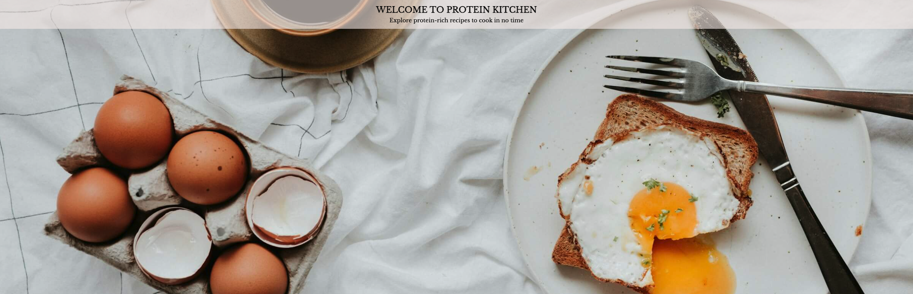
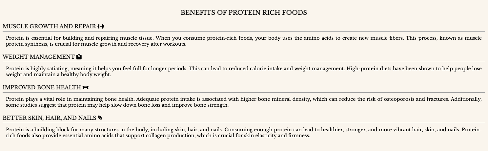
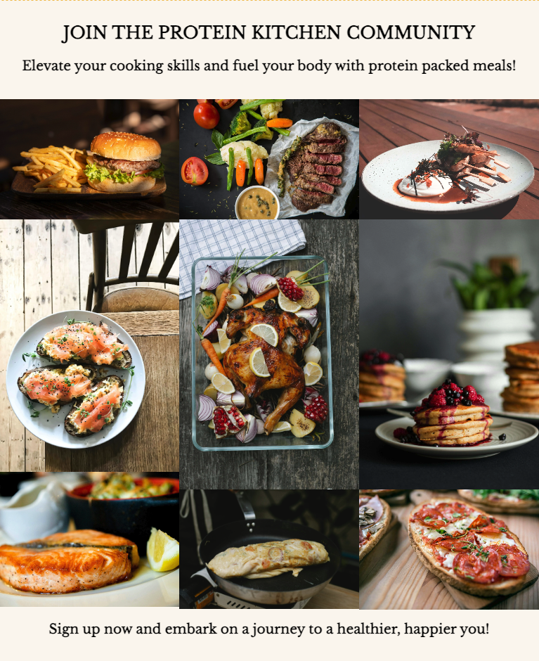
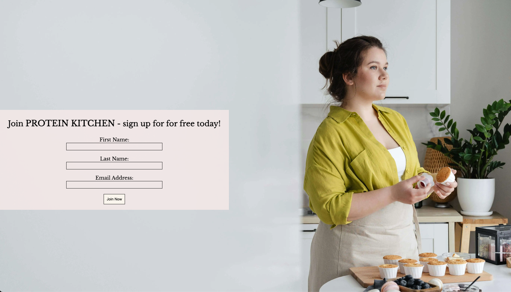

# Protein Kitchen

Welcome to [Protein Kitchen!](https://yanidruffy.github.io/protein-kitchen/index.html)

## Features
### Navigation Bar
The full responsive navigation bar is featured on all pages. It includes links to the home, recipes, and sign up pages for conventional navigation through the website. When clicking on the logo, it will also direct you to the home page.

### Hero Section
This section welcomes users to Protein Kitchen with a short but precise one liner to show what this site is about.
The hero text bar is clickable and will bring you to the recipes page.
The image shows a breakfast scenario that grabs the attention of the user.

### Benefits Section
In this part of the home page, we provide the user with information on the benefits of protein rich foods.
The user will see the value of this diet and should encourage the user to want to see the recipes.

### Footer Section
It contains Protein Kitchen's social media profiles.
A new tab will appear and the user will be redirected to the chosen social media platform, when clicking on it.
This further engages with the audience and encourages them to stay connected.

### Recipes Section
This page is here to get the user hooked on joining our community to access a wide range of protein packed recipes.
Most of the page is taken in by a visually appealing gallery, showcasing various dishes that makes the user want more.
The user will be redirected to the sign up page when clicking on an image.

### Sign-Up Section
The user is being provided with a sign-up form to become part of the Protein Kitchen community and enjoy access to all the recipes.
All fields are required in order to submit.
After submission, the page redirects you to Code Institute's dump site.

## Testing
## Deployment
## Credits
<!-- mention that I started committing in the past tense but learned about the best practices and submitted them in the present moving forward
also mention, submitting more frequently and in smaller scale -->

<!-- hero image credits:
Photo by Priscilla Du Preez: https://unsplash.com/photos/egg-on-white-ceramic-plate-beside-stainless-steel-fork-and-knife-9sgaZwWw-WA?utm_content=creditCopyText&utm_medium=referral&utm_source=unsplash/
  -->
<!-- gallery image credits:
Photo by Malidate Van: https://www.pexels.com/photo/steak-food-769289/
Photo by Engin Akyurt: https://www.pexels.com/photo/plate-of-fries-and-burger-3219483/
Photo by Tim Douglas : https://www.pexels.com/photo/tasty-baked-chicken-with-vegetable-and-fruit-mix-on-table-6210959/
Photo by Krisztina Papp: https://www.pexels.com/photo/cooked-fish-on-plate-2374946/
Photo by Geraud pfeiffer: https://www.pexels.com/photo/delicious-breakfast-with-fish-sandwiches-on-plate-6605207/
Photo by Klaus Nielsen: https://www.pexels.com/photo/appetizing-egg-roll-frying-on-pan-6294361/
Photo by Lachlan  Ross: https://www.pexels.com/photo/plate-with-meat-pieces-on-sticks-near-poached-egg-6510396/
Photo by Marta Dzedyshko: https://www.pexels.com/photo/plate-with-pancakes-topped-with-berry-jam-7175431/
Photo by Piotr Arnoldes: https://www.pexels.com/photo/tasty-toast-with-pepperoni-slices-on-cutting-board-6493569/
-->
<!-- signup image credits:
Photo by SHVETS production: https://www.pexels.com/photo/confectioner-cooking-tasty-cupcakes-in-kitchen-7525118/ -->
<!-- content credits:
https://www.healthline.com/nutrition/10-reasons-to-eat-more-protein#TOC_TITLE_HDR_9 -->
<!-- https://formdump.codeinstitute.net -->
