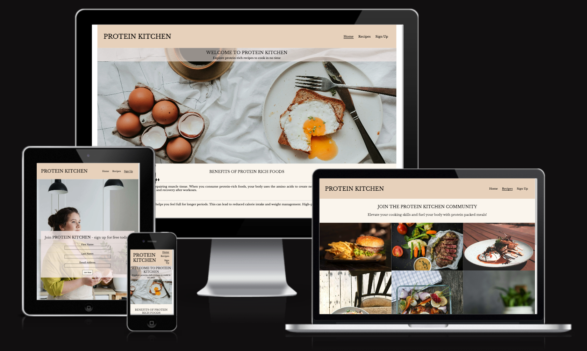

# Protein Kitchen

Welcome to [Protein Kitchen!](https://yanidruffy.github.io/protein-kitchen/index.html)

## Features
### Navigation Bar
The full responsive navigation bar is featured on all pages. It includes links to the home, recipes, and sign up pages for conventional navigation through the website. When clicking on the logo, it will also direct you to the home page.
### Hero Section

### Benefits Section
### Footer Section
### Recipes Section
### Sign-Up Section
## Testing
## Deployment
## Credits
<!-- mention that I started committing in the past tense but learned about the best practices and submitted them in the present moving forward -->

<!-- hero image credits:
Photo by Priscilla Du Preez: https://unsplash.com/photos/egg-on-white-ceramic-plate-beside-stainless-steel-fork-and-knife-9sgaZwWw-WA?utm_content=creditCopyText&utm_medium=referral&utm_source=unsplash/
  -->
<!-- gallery image credits:
Photo by Malidate Van: https://www.pexels.com/photo/steak-food-769289/
Photo by Engin Akyurt: https://www.pexels.com/photo/plate-of-fries-and-burger-3219483/
Photo by Tim Douglas : https://www.pexels.com/photo/tasty-baked-chicken-with-vegetable-and-fruit-mix-on-table-6210959/
Photo by Krisztina Papp: https://www.pexels.com/photo/cooked-fish-on-plate-2374946/
Photo by Geraud pfeiffer: https://www.pexels.com/photo/delicious-breakfast-with-fish-sandwiches-on-plate-6605207/
Photo by Klaus Nielsen: https://www.pexels.com/photo/appetizing-egg-roll-frying-on-pan-6294361/
Photo by Lachlan  Ross: https://www.pexels.com/photo/plate-with-meat-pieces-on-sticks-near-poached-egg-6510396/
Photo by Marta Dzedyshko: https://www.pexels.com/photo/plate-with-pancakes-topped-with-berry-jam-7175431/
Photo by Piotr Arnoldes: https://www.pexels.com/photo/tasty-toast-with-pepperoni-slices-on-cutting-board-6493569/
-->
<!-- signup image credits:
Photo by SHVETS production: https://www.pexels.com/photo/confectioner-cooking-tasty-cupcakes-in-kitchen-7525118/ -->
<!-- content credits:
https://www.healthline.com/nutrition/10-reasons-to-eat-more-protein#TOC_TITLE_HDR_9 -->
<!-- https://formdump.codeinstitute.net -->
