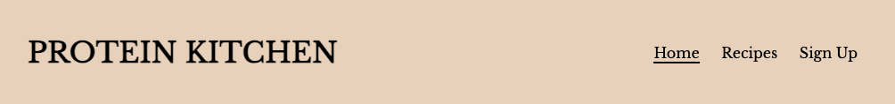
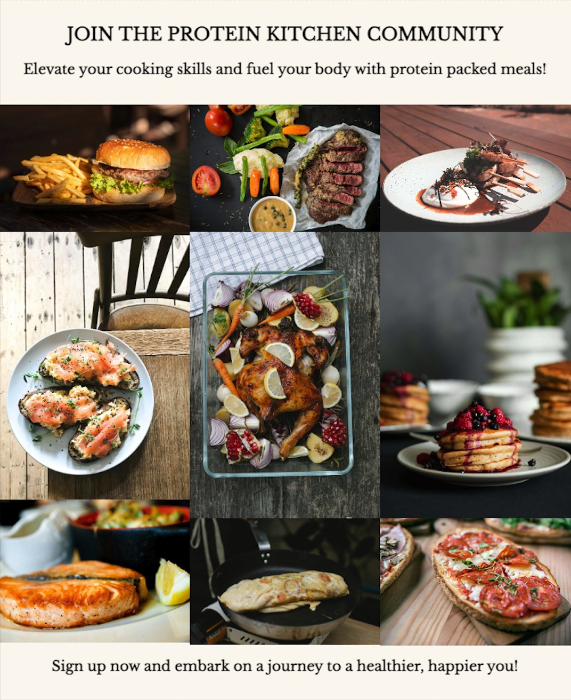

# Protein Kitchen

Welcome to [Protein Kitchen!](https://yanidruffy.github.io/protein-kitchen/index.html)

## Features
### Navigation Bar
The full responsive navigation bar is featured on all pages. It includes links to the home, recipes, and sign up pages for conventional navigation through the website. When clicking on the logo, it will also direct you to the home page.

### Hero Section
This section welcomes users to Protein Kitchen with a short but precise one liner to show what this site is about.
The hero text bar is clickable and will bring you to the recipes page.
The image shows a breakfast scenario that grabs the attention of the user.

### Benefits Section
In this part of the home page, we provide the user with information on the benefits of protein rich foods.
The user will see the value of this diet and should encourage the user to want to see the recipes.

### Footer Section
It contains Protein Kitchen's social media profiles.
A new tab will appear and the user will be redirected to the chosen social media platform, when clicking on it.
This further engages with the audience and encourages them to stay connected.

### Recipes Section
This page is here to get the user hooked on joining our community to access a wide range of protein packed recipes.
Most of the page is taken in by a visually appealing gallery, showcasing various dishes that makes the user want more.
The user will be redirected to the sign up page when clicking on an image.

### Sign-Up Section
The user is being provided with a sign-up form to become part of the Protein Kitchen community and enjoy access to all the recipes.
All fields are required in order to submit.
After submission, the page redirects you to Code Institute's dump site.

## Testing
## Deployment
The website was deployed using github pages using following method:
- Go to the "Settings" tab of your github repository
- Click on "Pages" on the left column
- Under "Source", select "main" branch
- Click on "Save" to deploy the website
- Once successfully deployed, a message with the live link will appear

### Committing Practices
At the start of this project, commits were written in past tense and were made infrequently and in larger batches. After learning about the best practices for commiting code, I made some changes. The messages are now in the imperative mood and commits are submitted more frequently and in smaller scales

## Credits
### Content
- The Font I used is from [Google Fonts](https://fonts.google.com/)
- The color palette I used is from [coolors](https://coolors.co/)
- The icons I used are from [Font Awesome](https://fontawesome.com/)
- The favicons I used are from [favicon](https://favicon.io/)
- The text content was created using [Perplexity](https://www.perplexity.ai/), the source is from [healthline](https://www.healthline.com/nutrition/10-reasons-to-eat-more-protein)

### Reference
- The inspiration for the layout of the website was [Code Institute's Love Running](https://github.com/Code-Institute-Solutions/love-running-v3) Project
- The readme was created by looking at different readme's from my fellow colleagues [Marceillo](https://github.com/Marceillo/mindfulness/blob/main/README.md) and [Sebastian](https://github.com/Mienjung97/Owning-Cats/blob/main/README.md) as well as [Code Institute's Love Running](https://github.com/Code-Institute-Solutions/readme-template) readme template

### Media
- The image to demonstrate the websites responsiveness was created using [Amiresponsive](https://ui.dev/amiresponsive
)
- The images were converted to webp using [Convertio](https://convertio.co/de/jpg-webp/)
- The images were resized using [Tinify](https://tinypng.com/)
- The hero image was taken from [Unsplash](https://unsplash.com/photos/egg-on-white-ceramic-plate-beside-stainless-steel-fork-and-knife-9sgaZwWw-WA?utm_content=creditCopyText&utm_medium=referral&utm_source=unsplash/)
- All other images were taken from [Pexels](https://www.pexels.com/) - link to the images are in the raw file

<!-- ### Acknowledgements -->
<!-- Special thank you to my Cohort Facilitator Kristyna and the colleagues in my slack group, especially the ones mentioned in the readme file. Spence, family -->

<!-- gallery image credits:
Photo by Malidate Van: https://www.pexels.com/photo/steak-food-769289/
Photo by Engin Akyurt: https://www.pexels.com/photo/plate-of-fries-and-burger-3219483/
Photo by Tim Douglas : https://www.pexels.com/photo/tasty-baked-chicken-with-vegetable-and-fruit-mix-on-table-6210959/
Photo by Krisztina Papp: https://www.pexels.com/photo/cooked-fish-on-plate-2374946/
Photo by Geraud pfeiffer: https://www.pexels.com/photo/delicious-breakfast-with-fish-sandwiches-on-plate-6605207/
Photo by Klaus Nielsen: https://www.pexels.com/photo/appetizing-egg-roll-frying-on-pan-6294361/
Photo by Lachlan  Ross: https://www.pexels.com/photo/plate-with-meat-pieces-on-sticks-near-poached-egg-6510396/
Photo by Marta Dzedyshko: https://www.pexels.com/photo/plate-with-pancakes-topped-with-berry-jam-7175431/
Photo by Piotr Arnoldes: https://www.pexels.com/photo/tasty-toast-with-pepperoni-slices-on-cutting-board-6493569/
-->
<!-- signup image credits:
Photo by SHVETS production: https://www.pexels.com/photo/confectioner-cooking-tasty-cupcakes-in-kitchen-7525118/ -->
